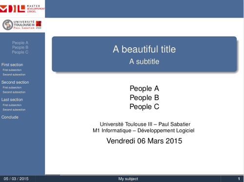
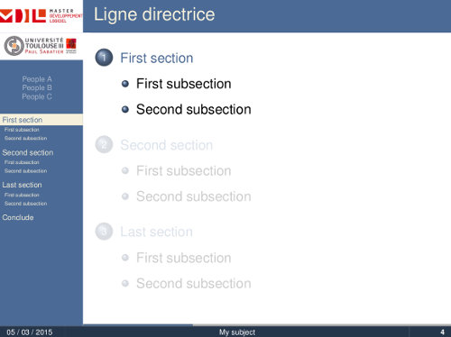
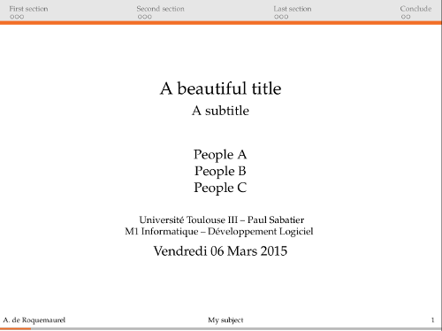
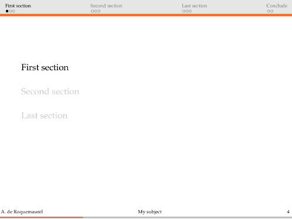

# Themes beamer
Themes for beamer with a examples of use.

2 themes are available, with examples of use in folder examples : 

## Lecture Theme

- beamerthemeLecture.sty : A theme for long presentation, with a side tableofcontents

  |  |  |
  | ----------------------------------------- | ----------------------------------------- |
  |                                           |                                           |

## Short Presentation Theme

- beamerthemeShortPresentation.sty : A theme for short and sober presentation

  |  |  |
  | ------------------------------------- | ------------------------------------- |
  |                                       |                                       |

